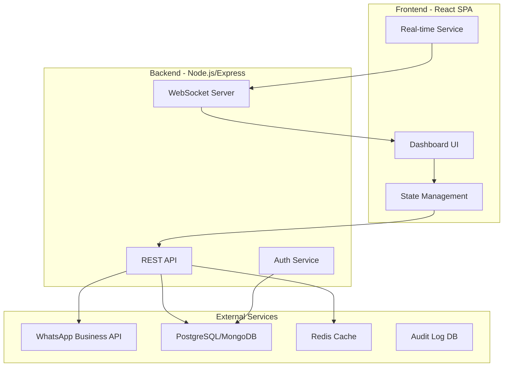

# WhatsApp Agent Contact Centre Dashboard - Design Document

## Executive Summary

This document outlines the current state analysis, design concept changes, and a comprehensive plan for building a production-ready **WhatsApp Agent Contact Centre Dashboard**. The system enables a single WhatsApp number to serve multiple branches by routing conversations to correct agents with full customer context, workflows, and auditability.

---

## 1. Current State Analysis

### 1.1 Technology Stack
| Component | Technology |
|-----------|------------|
| Frontend | React 18 + TypeScript |
| Build Tool | Vite |
| UI Components | shadcn/ui + Tailwind CSS |
| State Management | React Context + TanStack Query |
| Routing | React Router v6 |
| Icons | Lucide React |
| Date Handling | date-fns |

### 1.2 Existing Features
- ✅ Multi-branch support with branch switching sidebar
- ✅ Role-based access control (admin, branch_manager, agent)
- ✅ Conversation list with filtering by branch and status
- ✅ Chat window with messaging UI
- ✅ Customer context panel with notes and tags
- ✅ Agent transfer functionality
- ✅ Escalation workflow
- ✅ Authentication context with mock login

### 1.3 Current Architecture
```
┌─────────────────────────────────────────────────────────────────┐
│                         Frontend Layer                           │
│  ┌─────────────┐  ┌─────────────┐  ┌─────────────────────────┐ │
│  │ AuthContext │  │  ChatContext │  │   Dashboard Components  │ │
│  │             │  │             │  │  - Sidebar               │ │
│  │ - Login     │  │ - Messages  │  │  - ConversationList      │ │
│  │ - Logout    │  │ - Branches  │  │  - ChatWindow            │ │
│  │ - User Role │  │ - Agents    │  │  - CustomerContextPanel │ │
│  └─────────────┘  └─────────────┘  └─────────────────────────┘ │
└─────────────────────────────────────────────────────────────────┘
```

### 1.4 Gaps Identified
1. **No WhatsApp Integration** - Uses mock data, no actual WhatsApp Business API
2. **No Backend** - All state is client-side with mock data
3. **No Real-time Updates** - Polling or manual refresh required
4. **No Customer Profile/Customer 360** - Basic customer info only
5. **No Workflow Templates** - No canned responses or quick replies
6. **No Audit Trail** - Actions not logged
7. **No Analytics** - No reporting or dashboards
8. **No Notification System** - Missing desktop/audio notifications
9. **No SLA Tracking** - No response time monitoring
10. **No Knowledge Base** - No internal help documentation

---

## 2. Design Concept Changes

### 2.1 Recommended Architecture



### 2.2 Key Design Principles

| Principle | Description |
|-----------|-------------|
| **Single Number, Multiple Branches** | One WhatsApp business number routing to branch-specific agents |
| **Customer 360** | Complete view of customer interaction history |
| **Auditability** | Every action logged for compliance |
| **Workflow Automation** | Templates, quick replies, auto-responses |
| **Scalability** | Handle 1000+ concurrent conversations |
| **Role-Based UI** | Different views for agents, managers, admins |

### 2.3 Design Concept Changes

#### 2.3.1 Enhanced Dashboard Layout
**Current**: Fixed 3-column layout (Sidebar | Conversations | Chat | Context)

**Proposed**: Responsive adaptive layout with collapsible panels
```
┌────────────────────────────────────────────────────────────────────┐
│  Logo  │  Search  │  Notifications  │  Agent Status  │  User Menu  │
├────────┴─────────┴──────────────────┴────────────────┴─────────────┤
│                                                                      │
│  ┌──────────┐  ┌────────────────────┐  ┌─────────────────────────┐  │
│  │ Sidebar  │  │  Conversation      │  │                         │  │
│  │          │  │  Master View       │  │  Customer Context       │  │
│  │ - All    │  │  - List            │  │  - Profile              │  │
│  │ - Branch │  │  - Quick Actions   │  │  - History              │  │
│  │ - My Chats│ │  │  - Status Filter  │  │  - Notes                │  │
│  │ - Queue  │  └────────────────────┘  │  - Tags                  │  │
│  │          │  ┌────────────────────┐  │  - Actions               │  │
│  │ Agents   │  │  Chat Window       │  │                         │  │
│  │ Analytics│  │  - Messages        │  │  ┌───────────────────┐  │  │
│  │ Settings │  │  - Quick Replies   │  │  │ Workflow Panel    │  │  │
│  │          │  │  - Input Area      │  │  │ - Templates       │  │  │
│  └──────────┘  └────────────────────┘  │  │ - Macros          │  │  │
│                                        │  └───────────────────┘  │  │
│                                        └─────────────────────────┘  │
└────────────────────────────────────────────────────────────────────┘
```

#### 2.3.2 Conversation Routing Logic
```typescript
interface RoutingRule {
  id: string;
  name: string;
  priority: number; // Higher = evaluated first
  condition: {
    field: 'customer_phone' | 'tags' | 'message_content' | 'time' | 'branch';
    operator: 'equals' | 'contains' | 'starts_with' | 'regex';
    value: string;
  };
  action: {
    type: 'assign_to_agent' | 'assign_to_queue' | 'escalate' | 'auto_reply';
    targetId: string;
  };
}

const defaultRoutingRules: RoutingRule[] = [
  {
    id: 'loan-inquiry',
    name: 'Route Loan Inquiries',
    priority: 10,
    condition: { field: 'tags', operator: 'contains', value: 'Loan' },
    action: { type: 'assign_to_queue', targetId: 'loan-team' }
  },
  {
    id: 'vip-customer',
    name: 'VIP Customer Priority',
    priority: 20,
    condition: { field: 'customer_phone', operator: 'starts_with', value: '+26377' },
    action: { type: 'assign_to_agent', targetId: 'senior-agent-pool' }
  }
];
```

#### 2.3.3 Customer Profile Data Model
```typescript
interface CustomerProfile {
  id: string;
  phone: string;
  name: string;
  email?: string;
  whatsappProfile?: {
    profilePic?: string;
    status?: string;
  };
  tags: string[];
  segments: ('vip' | 'new' | 'returning' | 'high-value')[];
  totalConversations: number;
  totalMessages: number;
  averageResponseTime: number;
  satisfactionScore?: number;
  customFields: Record<string, any>;
  createdAt: Date;
  lastContactAt: Date;
}
```

#### 2.3.4 Audit Log Schema
```typescript
interface AuditLog {
  id: string;
  timestamp: Date;
  userId: string;
  userRole: UserRole;
  action: AuditAction;
  resourceType: 'conversation' | 'customer' | 'agent' | 'branch';
  resourceId: string;
  details: {
    before?: any;
    after?: any;
    reason?: string;
    metadata?: Record<string, any>;
  };
  ipAddress: string;
  userAgent: string;
}

type AuditAction = 
  | 'login' | 'logout'
  | 'conversation_open' | 'conversation_close'
  | 'conversation_assign' | 'conversation_transfer'
  | 'message_send' | 'message_edit' | 'message_delete'
  | 'customer_update' | 'notes_add' | 'tags_update'
  | 'escalate' | 'de_escalate'
  | 'settings_change';
```

---

## 3. Implementation Plan

### Phase 1: Foundation (Weeks 1-2)
- [ ] Set up backend API with Express.js
- [ ] Implement PostgreSQL database schema
- [ ] Create WhatsApp Business API integration service
- [ ] Implement WebSocket for real-time updates
- [ ] Build authentication system with JWT

### Phase 2: Core Features (Weeks 3-4)
- [ ] Enhanced conversation routing engine
- [ ] Customer 360 profile view
- [ ] Workflow templates and quick replies
- [ ] Agent assignment and load balancing
- [ ] Multi-branch queue management

### Phase 3: Analytics & Reporting (Weeks 5-6)
- [ ] Real-time dashboard metrics
- [ ] Agent performance reports
- [ ] SLA tracking and alerts
- [ ] Customer satisfaction tracking
- [ ] Export reports (PDF, CSV)

### Phase 4: Advanced Features (Weeks 7-8)
- [ ] Full audit logging system
- [ ] Knowledge base integration
- [ ] AI-powered suggested responses
- [ ] Advanced search and filters
- [ ] Mobile-responsive design

---

## 4. Minimum Viable Product (MVP) Scope

### 4.1 MVP Features

| Priority | Feature | Description |
|----------|---------|-------------|
| P0 | WhatsApp Integration | Send/receive messages via WhatsApp Business API |
| P0 | Real-time Messaging | WebSocket-based live chat updates |
| P0 | Agent Dashboard | Main interface for agents to handle conversations |
| P0 | Multi-Branch Routing | Route chats to correct branch based on rules |
| P0 | Customer Profiles | Store and display customer history |
| P0 | Basic Auth | Login/logout with role-based access |
| P1 | Quick Replies | Pre-defined response templates |
| P1 | Conversation Notes | Internal notes on customer conversations |
| P1 | Escalation Flow | Mark as escalated for supervisor review |
| P1 | Basic Analytics | Conversation counts, agent activity |
| P2 | Audit Logs | Log all important actions |
| P2 | Notifications | Desktop/audio alerts for new messages |

### 4.2 MVP Technical Requirements

#### Backend
```yaml
# Backend MVP Stack
- Node.js 20 LTS
- Express.js 4.x
- PostgreSQL 15
- Prisma ORM
- Socket.io 4.x
- JWT authentication
- WhatsApp Business Cloud API (Meta)
```

#### Frontend
```yaml
# Frontend MVP Stack (Existing + Additions)
- React 18 + TypeScript
- Vite 5.x
- Tailwind CSS + shadcn/ui
- Socket.io Client
- TanStack Query 5.x
- React Hook Form + Zod
- date-fns
```

### 4.3 MVP Database Schema

```sql
-- Core Tables
CREATE TABLE users (
    id UUID PRIMARY KEY DEFAULT gen_random_uuid(),
    email VARCHAR(255) UNIQUE NOT NULL,
    password_hash VARCHAR(255) NOT NULL,
    name VARCHAR(255) NOT NULL,
    role VARCHAR(50) NOT NULL CHECK (role IN ('admin', 'branch_manager', 'agent')),
    branch_id UUID REFERENCES branches(id),
    status VARCHAR(50) DEFAULT 'offline',
    created_at TIMESTAMP DEFAULT NOW(),
    updated_at TIMESTAMP DEFAULT NOW()
);

CREATE TABLE branches (
    id UUID PRIMARY KEY DEFAULT gen_random_uuid(),
    name VARCHAR(255) NOT NULL,
    location VARCHAR(500),
    whatsapp_number VARCHAR(50),
    routing_rules JSONB DEFAULT '[]',
    created_at TIMESTAMP DEFAULT NOW()
);

CREATE TABLE customers (
    id UUID PRIMARY KEY DEFAULT gen_random_uuid(),
    phone VARCHAR(50) UNIQUE NOT NULL,
    name VARCHAR(255),
    email VARCHAR(255),
    tags TEXT[] DEFAULT '{}',
    custom_fields JSONB DEFAULT '{}',
    created_at TIMESTAMP DEFAULT NOW(),
    last_contact_at TIMESTAMP
);

CREATE TABLE conversations (
    id UUID PRIMARY KEY DEFAULT gen_random_uuid(),
    customer_id UUID REFERENCES customers(id),
    branch_id UUID REFERENCES branches(id),
    assigned_agent_id UUID REFERENCES users(id),
    status VARCHAR(50) DEFAULT 'new',
    priority VARCHAR(50) DEFAULT 'normal',
    tags TEXT[] DEFAULT '{}',
    notes TEXT,
    created_at TIMESTAMP DEFAULT NOW(),
    updated_at TIMESTAMP DEFAULT NOW(),
    resolved_at TIMESTAMP
);

CREATE TABLE messages (
    id UUID PRIMARY KEY DEFAULT gen_random_uuid(),
    conversation_id UUID REFERENCES conversations(id),
    sender_id UUID REFERENCES users(id),
    sender_type VARCHAR(20) NOT NULL CHECK (sender_type IN ('customer', 'agent', 'system')),
    content TEXT NOT NULL,
    whatsapp_message_id VARCHAR(255),
    status VARCHAR(50) DEFAULT 'sent',
    created_at TIMESTAMP DEFAULT NOW()
);

CREATE TABLE audit_logs (
    id UUID PRIMARY KEY DEFAULT gen_random_uuid(),
    user_id UUID REFERENCES users(id),
    action VARCHAR(100) NOT NULL,
    resource_type VARCHAR(50),
    resource_id UUID,
    details JSONB,
    ip_address INET,
    created_at TIMESTAMP DEFAULT NOW()
);

CREATE TABLE quick_replies (
    id UUID PRIMARY KEY DEFAULT gen_random_uuid(),
    title VARCHAR(255) NOT NULL,
    content TEXT NOT NULL,
    tags TEXT[],
    branch_id UUID REFERENCES branches(id),
    created_by UUID REFERENCES users(id),
    created_at TIMESTAMP DEFAULT NOW()
);
```

### 4.4 MVP API Endpoints

| Method | Endpoint | Description |
|--------|----------|-------------|
| POST | /api/auth/login | User authentication |
| POST | /api/auth/logout | User logout |
| GET | /api/conversations | List conversations |
| GET | /api/conversations/:id | Get conversation details |
| PUT | /api/conversations/:id/status | Update status |
| PUT | /api/conversations/:id/assign | Assign to agent |
| POST | /api/conversations/:id/messages | Send message |
| GET | /api/customers/:phone | Get customer profile |
| PUT | /api/customers/:phone | Update customer |
| GET | /api/agents/:branchId | Get branch agents |
| GET | /api/quick-replies | Get quick replies |
| GET | /api/analytics/dashboard | Dashboard metrics |

### 4.5 MVP WebSocket Events

| Event | Direction | Description |
|-------|-----------|-------------|
| `conversation:new` | Server → Client | New conversation assigned |
| `message:received` | Server → Client | New customer message |
| `message:sent` | Server → Client | Confirm message sent |
| `conversation:updated` | Server → Client | Status/assignment change |
| `agent:status` | Client → Server | Update agent status |
| `typing:start` | Bidirectional | User is typing |
| `typing:stop` | Bidirectional | User stopped typing |

---

## 5. Next Steps

### Immediate Actions
1. ✅ Review and approve this design document
2. ⬜ Set up backend project structure
3. ⬜ Configure WhatsApp Business API credentials
4. ⬜ Create database schema migration files
5. ⬜ Build core API endpoints
6. ⬜ Implement frontend-backend integration

### Questions for Clarification
1. Which WhatsApp API solution will you use? (Meta Cloud API, Twilio, or other)
2. What's the expected concurrent user volume for MVP?
3. Are there specific compliance/regulatory requirements for audit logs?
4. Should the system support multiple WhatsApp numbers or single number?
5. What's the preferred hosting platform for production?

---

## 6. Estimated Timeline

| Phase | Duration | Deliverables |
|-------|----------|--------------|
| Foundation | 2 weeks | Backend API, Database, WhatsApp integration |
| Core Features | 2 weeks | Dashboard, Routing, Customer profiles |
| Analytics | 2 weeks | Reporting, SLA tracking |
| Advanced | 2 weeks | Audit logs, Knowledge base, Mobile |

**Total MVP Timeline: 8 weeks**

---

*Document Version: 1.0*
*Last Updated: 2026-02-04*
